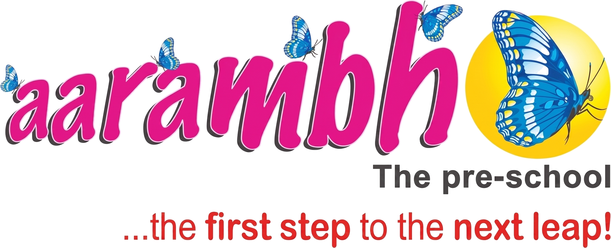

# Aarambh Pre-Primary School Website



A modern, fully responsive, and beautifully designed landing page for a pre-primary school. Built with a focus on clean aesthetics, joyful micro-interactions, and high performance.

## 🌟 Live Demo
*Can be deployed instantly on Vercel or GitHub Pages.*

## 🚀 Features
- **Zero Dependencies:** Built entirely with pure Vanilla HTML5, CSS3, and JavaScript. No build steps required.
- **Glassmorphism UI:** Features premium translucent styling and vibrant, child-friendly color palettes.
- **Fully Responsive:** Adapts flawlessly to mobile phones, tablets, and desktop displays using modern CSS Flexbox and Grid.
- **Dynamic Gallery:** Includes a built-in, lightweight JavaScript filtering system to sort gallery images instantly without reloading.
- **Smooth Navigation:** Sticky navbar with smooth anchor scrolling and auto-collapsing mobile menus.

## 📂 Project Structure
```text
/
├── index.html        # Main entry point containing semantic HTML structure
├── style.css         # Styling, animations, and responsive media queries
├── script.js         # Navigation logic, scroll handlers, and gallery filtering
└── img/              # All optimized image assets and transparent logos
```

## 🛠️ How to Deploy
Because this project uses zero frameworks and has no build step, deployment is instantaneous!

**Deploying to Vercel:**
1. Upload this repository to GitHub.
2. Go to Vercel.com and click **Add New Project**.
3. Import your GitHub repository.
4. Leave all build settings at their defaults (Vercel will detect it as a static site).
5. Click **Deploy**!

**Deploying to GitHub Pages:**
1. Upload this repository to GitHub.
2. Go to the repository **Settings** > **Pages**.
3. Under "Source", select the `main` branch.
4. Click **Save** and your site will be live!

## 💻 Local Development
To work on this locally, simply double-click the `index.html` file to open it in your browser. No local server or Node.js environment is required.

---
*Designed with ❤️ for early childhood education.*
